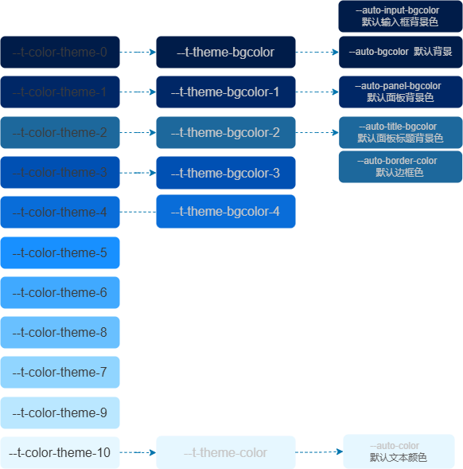

# 工作原理

设计开发`Themepro`的目的就是为了提供灵活、实时、简单的网站定制主题方案。

## 设计目标

我们设想中的主题方案应该达到以下要求：

- **简单易用**

只需要修改少数几个参数或变量就可以实现全站的主题颜色切换。

像`AntDesign`的主题方案虽然强大而灵活，但是超过`500+`的`Token`参数数量对于使用者来说太过复杂，成本太高了。
个人认为`AntDesign`的主题方案有些过度设计了。
实际使用中，绝大多数用户是难以驾驭`500+ Token`的,这导致定制主题的成本非常高昂，即便在官方提供了主题设计的情况下也是如何。

- **实时动态化**

可以动态修改主题颜色就可以实时动态生成主题样式。


- **用户友好**

普通的`css in js`的方案要求开发者定制生成主题包`CSS`，然后再加载使用。
我们希望能让网站的用户自行修改主题参数，就可以实时动态更改网站风格，而无需开发者参与重新开发主题。

- **性能优先**

主题变量应该尽可能保持轻量。我们不应使用过多的主题参数。要避免使用过于灵活的、参数过多的颜色方案。我们应该将精力集中在少数的几个颜色上。

## 设计思路

`Themepro`主题方案的核心思路是基于`四个主题参数`进行变量派生，实现全局动态网站主题方案。


- `主题色`： 指网站的各种背景主题颜色, 比较典型的有`dark`和`light`两种，但也可能扩展更多的色彩。
- `关键色`:  指定`primary`、`success`、`info`、`warning`、`danger`五种颜色的关键色。
- `元素尺寸`: 用于修改元素的尺寸，包括内外边距、字体大小等，共包含`x-small`、`small`、`medium`、`large`、`x-large`五级。
- `圆角尺寸`: 用于修改卡片、对话框等区块的圆角尺寸大小，取值包括`x-small`、`small`、`medium`、`large`、`x-large`五级


### 主题色

主题色主要用于各种背景色，一般情况下，只需要修改`themeColor`就可以更新整个网站的主题背景色。



#### 第1步：生成主题基准颜色梯度

基于输入的主题基准颜色，生成共`11`级的颜色梯度，基准颜色位于中间。


主题基准颜色共生成`11级`渐变色。如下:

```css 
:root{
    --t-color-theme-0: #001c49;
    --t-color-theme-1: #002766;
    --t-color-theme-2: #003a8c;
    --t-color-theme-3: #0050b3;
    --t-color-theme-4: #096dd9;
    --t-color-theme-5: #1890ff;
    --t-color-theme-6: #40a9ff;
    --t-color-theme-7: #69c0ff;
    --t-color-theme-8: #91d5ff;
    --t-color-theme-9: #bae7ff;
    --t-color-theme-10: #e6f7ff;
}
```

生成颜色梯度时，会根据基准颜色是`dark`还是`light`调整颜色梯度方向。


#### 第2步：生成主题颜色

基于上述生成的`11级`渐变色生成`5`种主题颜色：

定义`--t-theme-<?>`指向颜色梯度中序号`<1-10>`的对应颜色。
比如，`--t-theme-color`指向基准颜色序列中的第`10`级的颜色。


```ts
:root{
    --t-theme-color: var(--t-color-theme-10);
    --t-theme-bgcolor: var(--t-color-theme-0);
    --t-theme-bgcolor-1: var(--t-color-theme-1);
    --t-theme-bgcolor-2: var(--t-color-theme-2);
    --t-theme-bgcolor-3: var(--t-color-theme-3);
    --t-theme-bgcolor-4: var(--t-color-theme-4);
}
```

- `--t-theme-color`代表前景颜色，用于文字。
- `--t-theme-bgcolor-?`代表背景色，数字代表背景颜色的深浅,共有`5`个层级。

设计`--t-theme-bgcolor-?`的用途就是用于作为网站默认背景，卡片、面板等区块的背景色。

之所以只设计`5`个层级，是因为基于这样的假设，一个网站的的背景色一般不超过`3-5`种颜色，大部份`3`种即可满足不同区块的视觉需求。


:::warning 提示
当我们设计时，对卡片、对话框等背景时，优先使用`--t-theme-bgcolor-?`作为背景色。网站上的不同区块具有相同的色调，之间通过亮度变化达到区分不同区域的目的。
:::

#### 第3步：派生语义主题变量

接下来，基于上面生成的基础主题颜色,派生一系列语义主题颜色,如下：

```css
:root{    
    /* 背景颜色，用于面板/对话框/组件的背景 */
    --auto-bgcolor: var(--t-theme-bgcolor);
    /* 面板背景颜色：用于面板/区块/Drawer等背景颜色*/
    --auto-panel-bgcolor: var(--t-theme-bgcolor-1);
    /** 标题背景颜色：用于标题/标题栏的背景颜色*/
    --auto-title-bgcolor: var(--t-theme-bgcolor-2);
    /** 输入框背景颜色：用于输入框背景颜色*/
    --auto-input-bgcolor: var(--t-theme-bgcolor);
    /* 字体颜色 */
    --auto-color: var(--t-theme-color);
    /* 边框颜色 */
    --auto-border-color: var(--t-color-theme-2);
}
```


