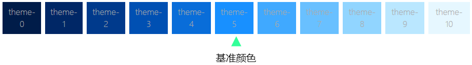
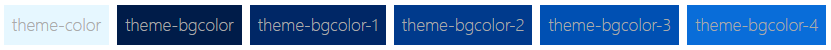
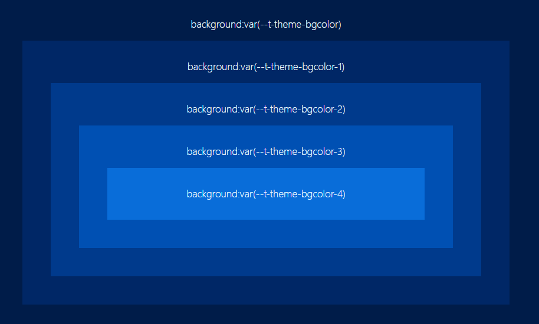

# ThemePro 设计原理

ThemePro 的设计目的是提供灵活、实时、简单的网站主题定制方案，让开发者和用户都能轻松地控制网站的视觉风格。

## 设计目标

ThemePro 的设计目标是创建一个既强大又易用的主题系统，具体包括：

### 1. 简单易用

只需修改少数几个参数或变量就可以实现全站的主题颜色切换。

与 AntDesign 等框架的主题方案相比，ThemePro 采用了更加精简的设计理念。AntDesign 的主题系统虽然强大而灵活，但超过 500+ 的 Token 参数对于大多数使用者来说过于复杂，学习和使用成本较高。

ThemePro 认为，一个好的主题系统应该是简单的，让开发者能够快速上手，而不需要深入了解复杂的设计系统理论。

### 2. 实时动态化

ThemePro 支持动态修改主题颜色，并实时生成主题样式，无需重新加载页面或重新编译样式。

这种实时性使得开发者可以快速预览主题变化，也让最终用户能够根据自己的喜好调整网站的视觉风格。

### 3. 用户友好

传统的 CSS-in-JS 方案通常要求开发者预先定制生成主题包 CSS，然后再加载使用。

ThemePro 的设计理念是让网站的用户能够自行修改主题参数，实时动态更改网站风格，而无需开发者参与重新开发主题。

### 4. 性能优先

ThemePro 的主题变量保持轻量，避免使用过多的主题参数。我们不追求过于灵活的、参数过多的颜色方案，而是将精力集中在少数几个关键主题变量上，确保主题系统的性能和可维护性。

## 核心设计思路

ThemePro 主题方案的核心思路是通过调节 5 个主题参数就可以动态调节整个网站的主题风格：

1. **主题色**：指网站的各种背景主题颜色，典型的有 `dark` 和 `light` 两种，也可扩展更多色彩。
2. **变体颜色**：指定 `primary`、`success`、`info`、`warning`、`danger` 五种语义化颜色。
3. **尺寸**：用于修改元素的尺寸，包括内外边距、字体大小等，共包含 `x-small`、`small`、`medium`、`large`、`x-large` 五级。
4. **圆角**：用于修改卡片、对话框等区块的圆角尺寸大小，取值包括 `none`、`x-small`、`small`、`medium`、`large`、`x-large` 六级。
5. **间距**：用于修改内外边距、行高等，取值为 `x-small`、`small`、`medium`、`large`、`x-large` 五级。

## 主题色系统实现原理

ThemePro 的主题色系统基于以下几个核心步骤：

### 第1步：生成主题基准颜色梯度

基于输入的主题基准颜色，ThemePro 会生成共 11 级的颜色梯度，基准颜色位于中间（第 5 级）。



主题基准颜色生成的 11 级渐变色如下：

```css 
:root{
    --t-color-theme-0: #001c49;
    --t-color-theme-1: #002766;
    --t-color-theme-2: #003a8c;
    --t-color-theme-3: #0050b3;
    --t-color-theme-4: #096dd9;
    --t-color-theme-5: #1890ff;  /* 基准颜色 */
    --t-color-theme-6: #40a9ff;
    --t-color-theme-7: #69c0ff;
    --t-color-theme-8: #91d5ff;
    --t-color-theme-9: #bae7ff;
    --t-color-theme-10: #e6f7ff;
}
```

生成颜色梯度时，ThemePro 会根据基准颜色是 `dark` 还是 `light` 自动调整颜色梯度方向：
- 如果基准颜色是亮色，梯度是从亮到暗
- 如果基准颜色是暗色，梯度是从暗到亮

这种自适应的梯度生成确保了无论是亮色系还是暗色系主题，都能生成视觉上协调的颜色系列。

### 第2步：生成主题颜色

基于上述生成的 11 级渐变色，ThemePro 会生成一系列主题颜色变量：



```css
:root{
    --t-theme-color: var(--t-color-theme-10);
    --t-theme-bgcolor: var(--t-color-theme-0);
    --t-theme-bgcolor-1: var(--t-color-theme-1);
    --t-theme-bgcolor-2: var(--t-color-theme-2);
    --t-theme-bgcolor-3: var(--t-color-theme-3);
    --t-theme-bgcolor-4: var(--t-color-theme-4);
}
```

这些变量的用途如下：
- `--t-theme-color`：代表前景颜色，用于文字。
- `--t-theme-bgcolor`：代表主背景色，用于页面背景。
- `--t-theme-bgcolor-?`：代表不同层级的背景色，数字代表背景颜色的深浅，共有 5 个层级。



ThemePro 设计 `--t-theme-bgcolor-?` 的理念是基于这样的假设：一个网站的背景色一般不超过 3-5 种颜色，大部分情况下 3 种即可满足不同区块的视觉需求。

> **提示**：当设计卡片、对话框等组件时，优先使用 `--t-theme-bgcolor-?` 作为背景色。这样网站上的不同区块会具有相同的色调，通过亮度变化达到区分不同区域的目的。

### 第3步：派生语义主题变量

基于上面生成的基础主题颜色，ThemePro 会派生一系列语义化的主题变量：

```css
:root{    
    /* 背景颜色，用于面板/对话框/组件的背景 */
    --auto-bgcolor: var(--t-theme-bgcolor);
    /* 面板背景颜色：用于面板/区块/Drawer等背景颜色*/
    --auto-panel-bgcolor: var(--t-theme-bgcolor-1);
    /** 标题背景颜色：用于标题/标题栏的背景颜色*/
    --auto-title-bgcolor: var(--t-theme-bgcolor-2);
    /** 输入框背景颜色：用于输入框背景颜色*/
    --auto-input-bgcolor: var(--t-theme-bgcolor);
    /* 字体颜色 */
    --auto-color: var(--t-theme-color);
    /* 边框颜色 */
    --auto-border-color: var(--t-color-theme-2);
}
```

这些语义化变量使得开发者可以更直观地使用主题颜色，而不需要记住具体的颜色变量名称。

## 变体颜色系统

ThemePro 提供了五种语义化的变体颜色：`primary`、`success`、`info`、`warning`、`danger`。每一种变体颜色也有对应的 11 级颜色梯度。

```css
{
    --t-{ primary | success | warning | danger | info }-color
    --t-color-{ primary | success | warning | danger | info }-0
    --t-color-{ primary | success | warning | danger | info }-1
    --t-color-{ primary | success | warning | danger | info }-2
    --t-color-{ primary | success | warning | danger | info }-3
    --t-color-{ primary | success | warning | danger | info }-4
    --t-color-{ primary | success | warning | danger | info }-5
    --t-color-{ primary | success | warning | danger | info }-6
    --t-color-{ primary | success | warning | danger | info }-7
    --t-color-{ primary | success | warning | danger | info }-8
    --t-color-{ primary | success | warning | danger | info }-9
    --t-color-{ primary | success | warning | danger | info }-10    
}
```

`--t-{ primary | success | warning | danger | info }-color` 指向变体颜色的基准色，即 `--t-color-{ primary | success | warning | danger | info }-5`。

例如，`--t-primary-color` 对应 `var(--t-color-primary-5)`，一般用于按钮背景色，或者作为标题字体颜色等。

| 颜色名称变量 | 默认值 | 自动变量 |
|------------|------|------|
| `--t-color-primary-5` | `--t-primary-color` | `--auto-primary-color` |
| `--t-color-success-5` | `--t-success-color` | `--auto-success-color` |
| `--t-color-warning-5` | `--t-warning-color` | `--auto-warning-color` |
| `--t-color-danger-5` | `--t-danger-color` | `--auto-danger-color` |
| `--t-color-info-5` | `--t-info-color` | `--auto-info-color` |

## 尺寸系统

ThemePro 的尺寸系统用于修改网站的外观尺寸，包括内外边距、字体大小等，共包含 `x-small`、`small`、`medium`、`large`、`x-large` 五级，默认为 `medium`。

以字体大小为例：

1. 在默认主题中定义了 `--t-font-size-<x-small | small | medium | large | x-large>`：

```css
{
    --t-font-size-x-small: 0.75rem;
    --t-font-size-small: 0.875rem;
    --t-font-size-medium: 1rem;
    --t-font-size-large: 1.25rem;
    --t-font-size-x-large: 1.5rem;
    --t-font-size-2x-large: 2.25rem;
    --t-font-size-3x-large: 3rem;
    --t-font-size-4x-large: 4.5rem;
}
```

2. 基于上面的值，派生定义了 `--auto-font-size` 变量：

```css
:root{
    --auto-font-size: var(--t-font-size-medium) 
}
[data-size=x-small] { --auto-font-size: var(--t-font-size-x-small) }
[data-size=small] { --auto-font-size: var(--t-font-size-small) }
[data-size=medium] { --auto-font-size: var(--t-font-size-medium) }
[data-size=large] { --auto-font-size: var(--t-font-size-large) }
[data-size=x-large] { --auto-font-size: var(--t-font-size-x-large) }
```

当调节 `data-size=<x-small | small | medium | large | x-large>` 时，整个网站的字体大小会按比例缩放，无需手动一个个设置，非常方便。

## 圆角系统

ThemePro 的圆角系统用于调节网站卡片、矩形、面板、对话框的圆角半径大小。取值包括 `none`、`x-small`、`small`、`medium`、`large`、`x-large` 六级。

1. 在默认主题中定义了 `--t-border-radius-<none | x-small | small | medium | large | x-large>`：

```css
{
    --t-border-radius-none: 0;
    --t-border-radius-x-small: 0.2rem;
    --t-border-radius-small: 0.3rem;
    --t-border-radius-medium: 0.5rem;
    --t-border-radius-large: 1rem;
    --t-border-radius-x-large: 1.2rem;
}    
```

2. 基于上面的值，派生定义了 `--auto-border-radius` 变量：

```css
:root{
    --auto-border-radius: var(--t-border-radius-medium) 
}
[data-radius=none] { --auto-border-radius: var(--t-border-radius-none) }
[data-radius=x-small] { --auto-border-radius: var(--t-border-radius-x-small) }
[data-radius=small] { --auto-border-radius: var(--t-border-radius-small) }
[data-radius=medium] { --auto-border-radius: var(--t-border-radius-medium) }
[data-radius=large] { --auto-border-radius: var(--t-border-radius-large) }
[data-radius=x-large] { --auto-border-radius: var(--t-border-radius-x-large) }
```

当调节 `data-radius=<none | x-small | small | medium | large | x-large>` 时，整个网站所有对话框/卡片等的圆角大小会同步调整。

## 间距系统

ThemePro 的间距系统用于控制网站的内外边距、行高、字间距等，取值为 `x-small`、`small`、`medium`、`large`、`x-large` 五级。

调节间距可以快速调整 `padding`、`margin`、`line-height`、`letter-spacing` 等间距，在视觉上增加网站页面的疏离感或紧凑感。

1. 定义五级的间距值：

```css
{
    --t-spacing-x-small: 0.6rem;
    --t-spacing-small: 1rem;
    --t-spacing-medium: 1.5rem;
    --t-spacing-large: 2rem;
    --t-spacing-x-large: 2.5rem;
}
```

2. 基于五级的间距值派生出 `--auto-spacing`、`--auto-padding`、`--auto-margin` 等变量：

```css
:root{
    --auto-spacing: var(--t-spacing-medium);
    --auto-padding: var(--t-spacing-medium);
    --auto-margin: var(--t-spacing-medium);
}
[data-spacing=x-small] { 
    --auto-spacing: var(--t-spacing-x-small);
    --auto-padding: var(--t-spacing-x-small);
    --auto-margin: var(--t-spacing-x-small);
}
[data-spacing=small] { 
    --auto-spacing: var(--t-spacing-small);
    --auto-padding: var(--t-spacing-small);
    --auto-margin: var(--t-spacing-small);
}
[data-spacing=medium] { 
    --auto-spacing: var(--t-spacing-medium);
    --auto-padding: var(--t-spacing-medium);
    --auto-margin: var(--t-spacing-medium);
}
[data-spacing=large] { 
    --auto-spacing: var(--t-spacing-large);
    --auto-padding: var(--t-spacing-large);
    --auto-margin: var(--t-spacing-large);
}
[data-spacing=x-large] { 
    --auto-spacing: var(--t-spacing-x-large);
    --auto-padding: var(--t-spacing-x-large);
    --auto-margin: var(--t-spacing-x-large);
}
```

## 自动变量系统

ThemePro 的一个核心特性是自动变量系统。自动变量以 `--auto-` 开头，会根据当前的主题、尺寸、圆角和间距设置自动更新。

这些自动变量使得开发者可以专注于使用语义化的变量名，而不需要关心具体的主题设置：

```css
.my-component {
    color: var(--auto-color);
    background-color: var(--auto-bgcolor);
    padding: var(--auto-padding);
    border: var(--auto-border);
    border-radius: var(--auto-border-radius);
    font-size: var(--auto-font-size);
}
```

当用户切换主题或调整尺寸设置时，使用自动变量的元素会自动更新样式，无需任何额外的 JavaScript 代码。

## 技术实现

ThemePro 的核心实现基于以下几个关键技术：

1. **CSS 变量**：使用 CSS 自定义属性（变量）实现主题切换，无需重新加载页面。
2. **HTML 数据属性**：使用 `data-theme`、`data-size`、`data-radius` 和 `data-spacing` 属性控制主题设置。
3. **JavaScript API**：提供 `themePro` 对象，用于动态修改主题设置和创建自定义主题。
4. **颜色转换算法**：使用 HSL 颜色空间进行颜色计算，生成协调的颜色梯度。

## 总结

ThemePro 的设计理念是"简单而强大"，通过精心设计的变量系统和自动化机制，让开发者和用户都能轻松控制网站的视觉风格。

与其他复杂的主题系统相比，ThemePro 专注于少数几个关键参数，但这些参数能够覆盖大多数主题定制需求，实现了简单性和功能性的平衡。